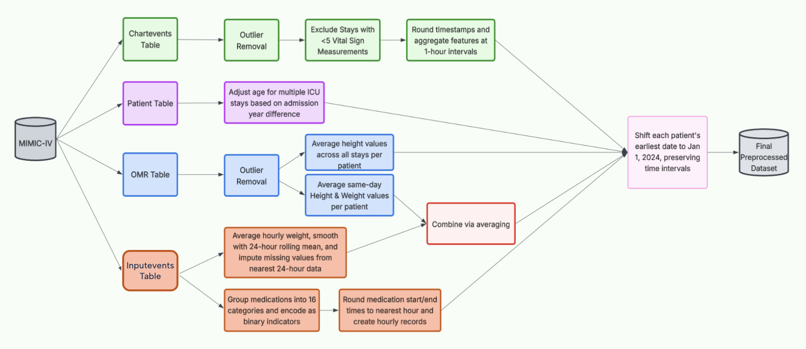

A standardized benchmark was developed through comprehensive preprocessing to ensure fair and consistent comparison across all methods.

The preprocessing began with extracting the **six most common vital signs**- heart rate (HR), respiratory rate (RR), oxygen saturation (pulse oximetry) (O2SP), and non-invasive blood pressure: diastolic (NIBPD), systolic (NIBPS), and mean (NIBPM)- from the `chartevents` table, along with their associated timestamps and unique identifiers for each patient stay. Following this, demographic information— **age** and **gender**—was retrieved from the `patients` table. Physical characteristics, including **height**, **weight**, and **BMI**, were then extracted from the `omr` table after appropriate preprocessing. Finally, data on **continuous and bolus infusions** were collected from the `inputevents` table.

The flowchart below outlines these preprocessing steps in greater detail.

