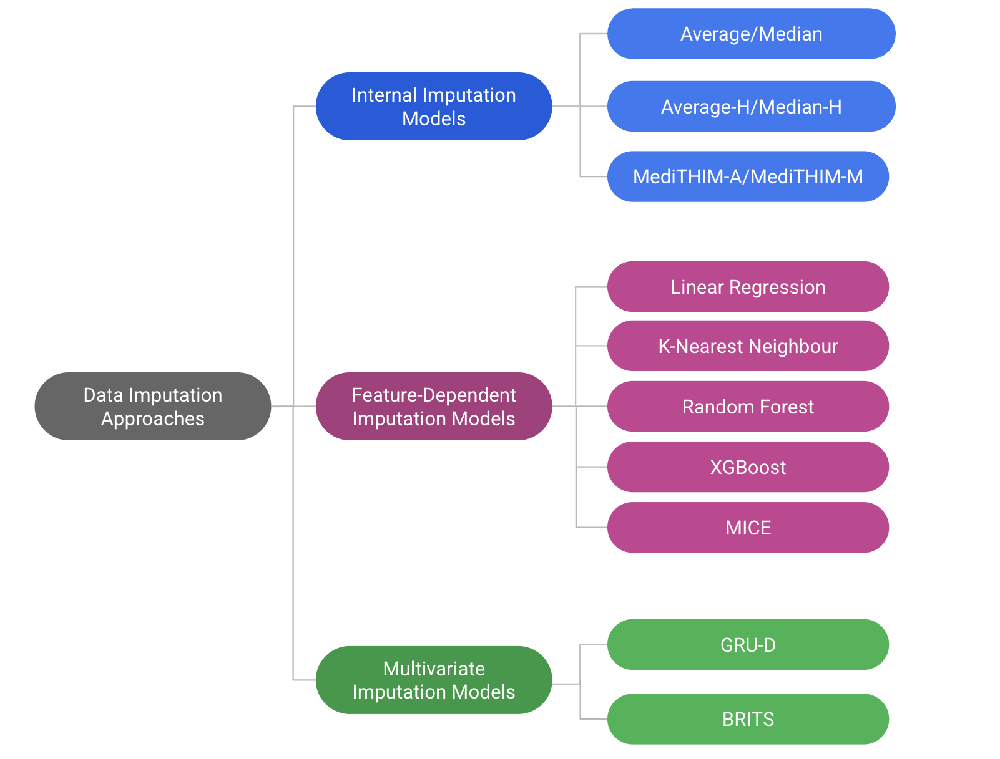
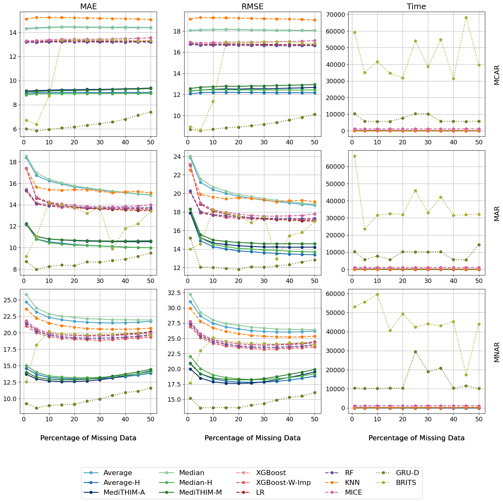
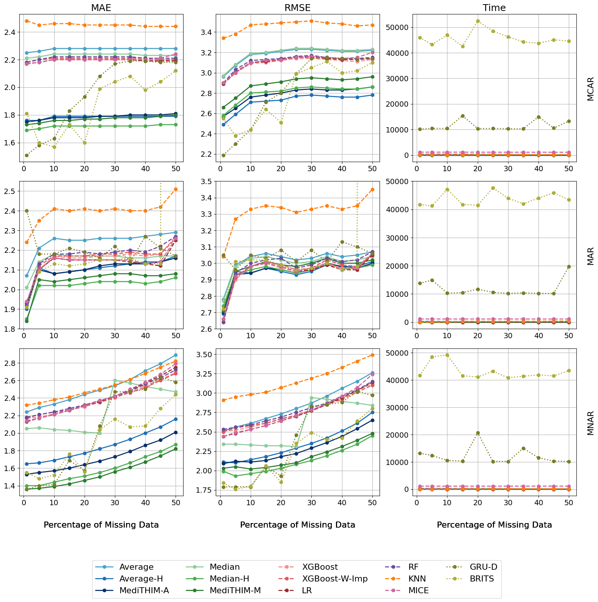

# MediTHIM: Temporal Hierarchical Imputation Methods for Medical Time Series

This repository contains the code and resources for the corresponding paper [1], presenting a novel statistical hierarchical approach for imputing missing values in temporal medical datasets. The proposed method, which offers fast computation with minimal resource requirements, outperforms multiple models and baselines used in this research. For time series imputation in this research, the following information about ICU patients was extracted from the MIMIC-IV [2,3] dataset:

- Six routine vital signs: heart rate (**HR**), respiratory rate (**RR**), oxygen saturation (pulse oximetry) (**O2SP**), and non-invasive blood pressure—diastolic (**NIBPD**), systolic (**NIBPS**), and mean (**NIBPM**).
  
- Two Types of Demographic Information: Gender and age.

- Three Physical Characteristics: Height, weight, and body mass index (BMI).

- Administered Medications.

### Data Preprocessing
---

- **Outlier Removal:** Outliers in demographic data, vital signs, and physical characteristics were removed based on the following value ranges:
    | Variable                   | Min Value | Max Value |
  |----------------------------|----------|----------|
  | Heart Rate                | -3       | 303      |
  | Respiratory Rate          | -3       | 303      |
  | Oxygen Saturation         | -1       | 101      |
  | Non-invasive BP diastolic | -5       | 505      |
  | Non-invasive BP systolic  | -5       | 505      |
  | Non-invasive BP mean      | -5       | 505      |
  | Weight                    | 40       | 1435     |
  | Height                    | 20       | 110      |
  | BMI                       | 5        | 190      |

- **Timestamp Standardization:**
  - Timestamps for the six vital signs were rounded to the nearest hour with a 30-minute threshold applied (If no record was available for a given time, it was replaced with null values). Data were aggregated at one-hour intervals for consistency across patients.
  - To standardize medication administration timing, start and end times were rounded to the nearest hour using a 30-minute threshold. New records were created for each medication at each rounded hour within the administration period.
 
- **Medication Categorization:** Medications were grouped into 16 main categories and encoded in binary format (1 for received, 0 for not received).
 
- **Physical Characteristics Preprocessing**:
  - Height values were averaged across all stays (All patients were adults, so height changes were negligible).
  - Weight values from the medication table were averaged hourly and smoothed using a 24-hour rolling mean to account for fluctuations. The resulting values were then averaged with weights from the OMR table.
  - Update BMI using the new height and weight values.

### Introducing Missingness
---
**Three distinct missingness patterns** (Missing Completely at Random (MCAR), Missing at Random (MAR), Missing Not at Random (MNAR)) and **eleven missing data ratios**, including 1%, and ranging from 5% to 50% in 5% increments, were applied to each vital sign.
  - To generate MCAR and MNAR, the `produce_NA` function was used, with references to [this guide](https://rmisstastic.netlify.app/how-to/python/generate_html/how%20to%20generate%20missing%20values) and the [GitHub repository](https://github.com/BorisMuzellec/MissingDataOT).
  - The MAR pattern was created by identifying the feature most strongly correlated with the target column. A specified number of missing values were introduced: half were selected from the smallest values and the other half from the largest values of the correlated feature. Finally, the corresponding rows in the target column were set to missing.

### Data Imputation Methods
---

Various models were used to assess the imputation process for medical time series, categorized according to their distinct characteristics as follows:
  

In the **Internal Imputation Models** category, the models focus solely on imputing the missing values of the target column. In contrast, **Feature-Dependent Imputation Models** leverage other features in the dataset to   predict and fill in the missing values. **Multivariate Imputation Models** can be considered hybrid approaches, as they utilize both the target feature and additional variables in the dataset to perform the imputation.

The core idea behind the newly introduced statistical approach, `MediTHIM-A/MediTHIM-M`, is to leverage historical data within a hierarchical framework to impute missing values. The hierarchy is designed to first search for past data from the same patient and admission, and if unavailable, to fall back on historical data from the same patient across other admissions. `Average-H/Median-H` follows the same logic but, in addition to historical records, it also incorporates future records for imputation. `Average/Median` calculates the statistics of the target column in the training dataset to impute the target column in the test dataset. 

### Results & Conclusions
---

  
  

## References
[1]. Hashemolhosseiny, Helia, and Paula Branco. ”MediTHIM: Temporal Hierarchical Imputation Methods for Medical
Time Series.” International Conference on Industrial, Engineering and Other Applications of Applied Intelligent
Systems. Springer, 2025 (accepted - to appear)

[2]. Johnson, Alistair EW, et al. "MIMIC-IV, a freely accessible electronic health record dataset." Scientific data 10.1 (2023): 1. [Link to paper](https://www.nature.com/articles/s41597-022-01899-x)

[3]. Johnson, A., et al. "MIMIC-IV (version 2.2). PhysioNet.[Internet]." 2023. [Link to website](https://physionet.org/content/mimiciv/2.2/)

  

